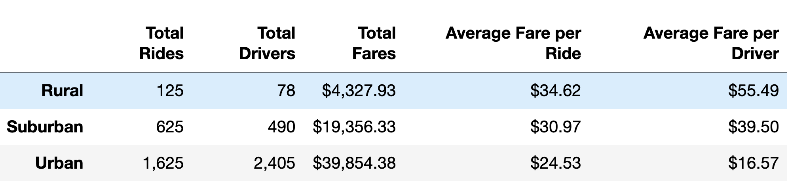
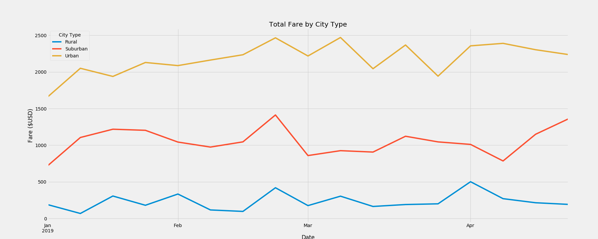
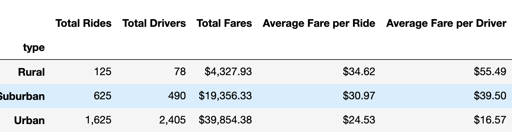

# PyBer_Analysis

Module 5 Challenge

Paragraph 1:
- Describe the purpose, or the reason, you did this assignment.
- How did you analyze the data to create the technical deliverables?
- What can be said about the summary DataFrame and multiple-line graph with respect to the ride-sharing data among the different    city types? Include images of the summary DataFrame table and the multiple-line graph in these results.
- A short summary of the results.

Paragraph 2:
- What challenges or difficulties did you encounter? If none, then briefly explain what challenges or difficulties may be encountered and how to avoid them using technical analysis.
- Explain how you overcame any challenges or difficulties, and include what technical analysis you used to overcome the challenges or difficulties.

Paragraph 3:
- Based on the data from the different city types, what recommendations would you give the CEO for addressing any disparities among the city types?
- Provide two additional analyses you could do to gain more insight into the data, like using other datasets.
What technical steps would you take to perform the additional analyses?

    The purpose of this assignment was to prepare additional summary visiualizations of ride-sharing data from Pyber using matplotlib. The first delivarable was a DataFrame showing the total rides, total drivers, total fares, average fare per ride and average fare per driver for each city type. This was produced by first calculating the the ride total, fare total and driver total for each city type using .groupby() and .sum(). Next the average fare per ride and average fare per driver was calculated by dividing the total fares by the total rides and the total fares by total drivers for each city type. this information was then put into multiple arrays and displyed using a Pandas DataFrame. The second deliverable was a line chart displaying the total fares by city type over a period of time between January 1st, 2019 to April 28th, 2019. This was done by producing a pivot table showing each individual fare and its time-stamp, and placing these fares into a dataframe containg weekly totals for each city type using .resample(). This information was then diplayed using MatPlotLib's FiveThirtyEight style. From the "summary_df" one can see that Rural cities have the lowest total rides, total fares, and total drivers, however, they have the highest average fare per ride and average fare per driver. This is likely due to the fact that each ride is a longer distance. The opposite can be said for the Uraban cities, which have the highest total rides, total fares, and total drivers, but the lowest average fare per ride and average fare per driver. The same information about total fares in reflected in the graph.
    

    While creating the deliverables I faced a few techincal difficulties. The first issue was a formatting issue that occured while formatting the summary_df, an errant column header above the city type column caused the other column headings to be misaligned (see attached image). I rectified this be using .rename_axis() and setting the axis to "None". Another arose while trying to set the 'Date' column in the city_fare_df to the datetime64 data type. this was rectified by using Pandas .to_datetime() function on the 'Date' column of the DataFrame.
    

    In order to address some of the disparities between the different city types I would recommend that fares be reduced for rural areas, as it may be hindering growth. However one must take into consideration the costs for drivers operating in rural areas as well, so some additional data on the distances that drivers cover for each ride would be useful here. Another reccomendation I would have is in regards to 'Total Drivers' being greater than 'Total Rides' in urban areas. This suggests that many drivers did not have a single ride over the period of time in question. Some additional analysis on the average number of rides per driver would be useful as well as additional data on whether or not drivers were actively seeking fares.
  

